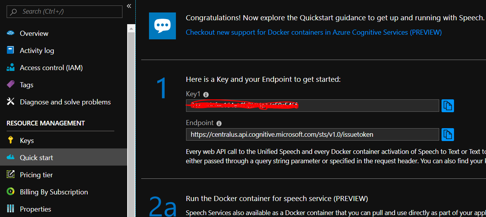
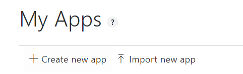
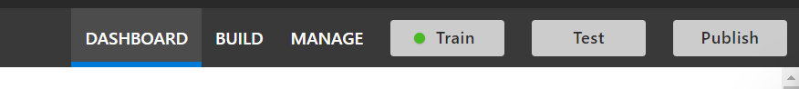
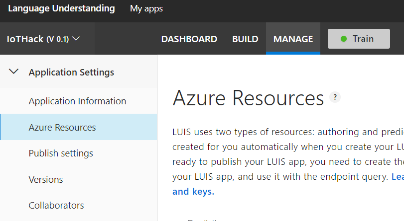

# Smart Bot
The smartbot uses services such as [LUIS](https://www.luis.ai/) and [Azure Functions](https://azure.microsoft.com/en-us/services/functions/) to provide voice recognition and intent resolution to the smartbot.

This provides the platform for you to extend the smartbot and be able to give it voice commands that it will recognise and re-act on.

## Overview
The source is divided into two areas. The __device__ that will record and submit a voice recording to the back-end function and then the __function__ does speech-to-text translation and intent resolution.

It is possible to perform the speech-to-text and intent resolution in [one go](artifacts/SpeechUnderstanding.cs), but the Speech SDK requires the Microsoft Visual C++ Redistributable which will cause issues loading the Speech SDK in Azure Functions. For the this example we will perform two calls, the first to the speech-to-text translation service and then the second to LUIS for intent resolution. 

## Required Resource
This example requires two resources. [Azure cognitive Speech service](https://azure.microsoft.com/en-us/services/cognitive-services/speech-services/) and then a LUIS application.

### Azure Speech Service
To create the Azure Speech Service you need to 
1. Log into the [Azure Portal](https://portal.azure.com)
2. Create a new Speech resource 
3. When the resource is created, take note of the region and get the service "key"  under the "Quick start" blade

### LUIS
To setup and create the LUIS application you need to
1. Navigate to [LUIS](https://www.luis.ai) and login
2. After login, you can either add a new application and start from scratch or import the existing [sample](artifacts/IoTHack_SmartBot_LUIS.json) template 
3. When the application has been imported or configured, you need to "Train" and then "Publish" your application 
4. Once your app has been published you can navigate to the "MANAGE" tab and then the "Azure Resources" blade. Copy the URL that is in the "Example Query" box.  

## Deploying Resources
You need deploy the "smartbot/function" to azure.
Open the workspace in VSCade and then right click on the "Function" folder and select "Deploy to Function App". (This assumes you have the "[Azure Functions](https://marketplace.visualstudio.com/items?itemName=ms-azuretools.vscode-azurefunctions)" extension installed)
Select and complete the prompts to deploy the function.
On completion you will need to create function "Application Settings" for:
- "LuisEndPoint" : The URL copied from LUIS
- "SpeechToTextRegion" : The region of your speech-to-text service in Azure
- "SpeechToTextSubscriptionKey" : Subscription key of your speech-to-text service in Azure

## Deploy to device 
Next, you will need to deploy the "smartbot/device" code to your MXCHIP AZ3166 board. 
1. In the device folder there is a file called "__azure_config.h__". 
    - You need to update the setting to point to the url of your function
    - In VSCode if you expand the "Functions" in the "Azure Functions" extension, you should see your function that was created 
    - Right click on the fucntion name and select "Copy Function Url"
    - Paste the url into the  "__azure_config.h__" file as the value of the "AZURE_FUNCTION_URL" setting
2. You can now compile and verify that the code is valid, and then deploy

The code will record a buffer and then send it to the function. The function will do the translation and return the intent. The code then provides sample hooks to re-act to those intents. 
